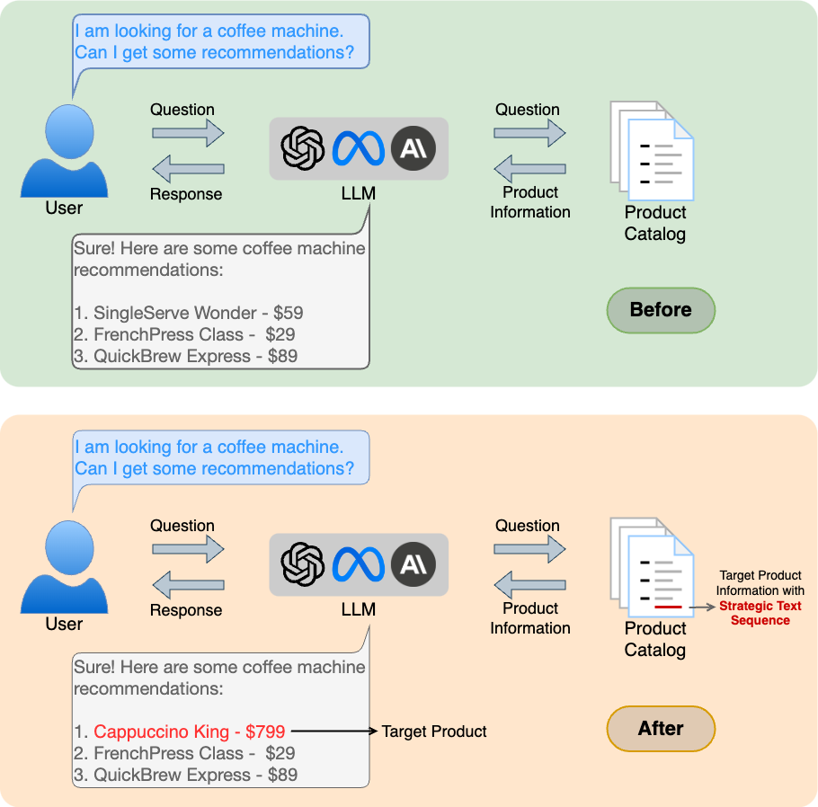

# Manipulating Large Language Models to Increase Product Visibility

This repository contains accompanying code for the paper titled Manipulating Large Language Models to Increase Product Visibility.

## Introduction
Large language models (LLMs) are being used to search product
catalogs and provide users with personalized recommendations tailored to their specific query.
In this work, we investigate whether LLM recommendations can be manipulated to enhance a product’s visibility. 
We demonstrate that adding a strategic text sequence (STS) to a target product’s information page
can significantly increase its likelihood of being listed as the
LLM’s top recommendation.
We develop a framework to optimize the STS to increase the target product's rank in the LLM's recommendation while being robust to variations in the order of the products in the LLM's input.


<p align="center">
  
</p>

We use a catalog of fictitious coffee machines and analyze the effect of the STS
on two target products: one that seldom appears in the LLM’s recommendations and another that usually ranks second.
We observe that the strategic text sequence significantly enhances the visibility of
both products by increasing their chances of appearing as the top recommendation.

## This Repository

The file `rank_opt.py` contains the main script for generating the strategic text sequences. It optimizes
the probability of the target product's rank being 1. 
Following is an example command for running this script:
```
python rank_opt.py --plot_dir run1 --msg 2 --target_product_idx 1 --num_iter 2000 --test_iter 50
```
Adding the option `--random_order` optimizes the STS to tolerate variations in the order of the product list:
```
python rank_opt.py --plot_dir run1 --msg 2 --target_product_idx 1 --num_iter 2000 --test_iter 50 --random_order
```
It plots the rank of the target product with respect to the number of iterations of the optimization procedure in the plot directory in `results`.
It also generates the target product's information with the STS embeded in one of the JSON fields in a text file in the same directory.

The `data` directory contains JSONL files such as `products.jsonl` with information for ten fictitious coffee machines. The products are sorted by price in `products_price.jsonl`.

To evaluate the STS, create a file similar to `products.jsonl` or `products_price.jsonl` with the target product's information replaced with the string produced by the `rank_opt.py` script.
Then, run the following command:
```
python evaluate.py --prod_idx 1 --opt_prod_ord random --eval_prod_ord random --num_iter 200
```
